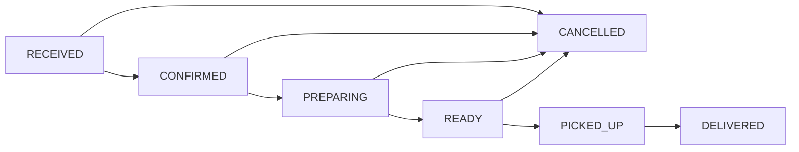

## Overview

The order transitions module provides validation logic for state changes in the order lifecycle. It ensures that orders can only transition between valid states, maintaining data integrity and business rule compliance.

## canTransition

Validates whether an order can transition from one status to another based on predefined business rules.

### Function Signature

```typescript
function canTransition(from: OrderStatus, to: OrderStatus): boolean
```

### Parameters

<ParamField path="from" type="OrderStatus" required>
  The current status of the order. Must be a valid `OrderStatus` value.
</ParamField>

<ParamField path="to" type="OrderStatus" required>
  The desired target status. Must be a valid `OrderStatus` value.
</ParamField>

### Returns

<ResponseField name="boolean" type="boolean">
  Returns `true` if the transition is allowed, `false` otherwise.
</ResponseField>

## Transition Rules

The complete transition matrix defines which status changes are permitted:

```typescript
const ALLOWED_TRANSITIONS: Record<OrderStatus, OrderStatus[]> = {
  RECEIVED: ["CONFIRMED", "CANCELLED"],
  CONFIRMED: ["PREPARING", "CANCELLED"],
  PREPARING: ["READY", "CANCELLED"],
  READY: ["PICKED_UP", "CANCELLED"],
  PICKED_UP: ["DELIVERED"],
  DELIVERED: [],
  CANCELLED: [],
};
```

### Valid Transitions

<Tabs>
  <Tab title="RECEIVED">
    **From RECEIVED, can transition to:**
    - **CONFIRMED** - Kitchen acknowledges and accepts the order
    - **CANCELLED** - Order is cancelled before confirmation
    
    <Note>
      RECEIVED is the initial state for new orders. Orders must be confirmed before preparation can begin.
    </Note>
  </Tab>
  
  <Tab title="CONFIRMED">
    **From CONFIRMED, can transition to:**
    - **PREPARING** - Kitchen begins order preparation
    - **CANCELLED** - Order is cancelled after confirmation but before prep
    
    <Note>
      Once confirmed, the order is in the kitchen's queue and ready to be worked on.
    </Note>
  </Tab>
  
  <Tab title="PREPARING">
    **From PREPARING, can transition to:**
    - **READY** - Order preparation is complete
    - **CANCELLED** - Order is cancelled during preparation
    
    <Note>
      Active preparation state. Cancellation during this phase may involve waste.
    </Note>
  </Tab>
  
  <Tab title="READY">
    **From READY, can transition to:**
    - **PICKED_UP** - Order is collected by customer or driver
    - **CANCELLED** - Order is cancelled while waiting for pickup
    
    <Note>
      The order is complete and waiting. Cancellation at this stage is uncommon.
    </Note>
  </Tab>
  
  <Tab title="PICKED_UP">
    **From PICKED_UP, can transition to:**
    - **DELIVERED** - Order successfully delivered to customer
    
    <Note>
      Once picked up, the only valid transition is to DELIVERED. Cancellation is no longer possible.
    </Note>
  </Tab>
  
  <Tab title="Terminal States">
    **DELIVERED and CANCELLED are terminal states.**
    
    No transitions are allowed from these states. Orders in these states are considered final.
    
    - **DELIVERED**: Successful completion
    - **CANCELLED**: Order terminated
  </Tab>
</Tabs>

## Usage Examples

<CodeGroup>

```typescript Basic Validation
import { canTransition } from "@/domain/order/order-transitions";

// Check if transition is valid
if (canTransition("RECEIVED", "CONFIRMED")) {
  console.log("Valid transition");
  // Proceed with status update
} else {
  console.log("Invalid transition");
  // Show error to user
}
```

```typescript State Update with Validation
import { canTransition } from "@/domain/order/order-transitions";
import { OrderStatus } from "@/domain/order/order-status";

async function updateOrderStatus(
  orderId: string,
  currentStatus: OrderStatus,
  newStatus: OrderStatus
) {
  if (!canTransition(currentStatus, newStatus)) {
    throw new Error(
      `Cannot transition from ${currentStatus} to ${newStatus}`
    );
  }
  
  // Perform the status update
  await orderRepository.updateStatus(orderId, newStatus);
  console.log(`Order ${orderId} transitioned to ${newStatus}`);
}

// Usage
try {
  await updateOrderStatus("123", "PREPARING", "READY"); // Success
  await updateOrderStatus("123", "READY", "RECEIVED"); // Throws error
} catch (error) {
  console.error(error.message);
}
```

```typescript React Hook
import { canTransition } from "@/domain/order/order-transitions";
import { OrderStatus } from "@/domain/order/order-status";

function useOrderTransition(currentStatus: OrderStatus) {
  const getAvailableTransitions = () => {
    const allStatuses: OrderStatus[] = [
      "RECEIVED",
      "CONFIRMED",
      "PREPARING",
      "READY",
      "PICKED_UP",
      "DELIVERED",
      "CANCELLED",
    ];
    
    return allStatuses.filter((status) =>
      canTransition(currentStatus, status)
    );
  };
  
  const canMoveTo = (targetStatus: OrderStatus) => {
    return canTransition(currentStatus, targetStatus);
  };
  
  return {
    availableTransitions: getAvailableTransitions(),
    canMoveTo,
  };
}

// Component usage
function OrderActions({ order }) {
  const { availableTransitions, canMoveTo } = useOrderTransition(order.status);
  
  return (
    <div>
      {availableTransitions.map((status) => (
        <button
          key={status}
          onClick={() => handleStatusChange(status)}
          disabled={!canMoveTo(status)}
        >
          Move to {status}
        </button>
      ))}
    </div>
  );
}
```

```typescript Middleware Example
import { canTransition } from "@/domain/order/order-transitions";

// Express middleware for API validation
async function validateTransition(req, res, next) {
  const { orderId, newStatus } = req.body;
  
  // Fetch current order status
  const order = await getOrder(orderId);
  
  if (!canTransition(order.status, newStatus)) {
    return res.status(400).json({
      error: "Invalid status transition",
      currentStatus: order.status,
      attemptedStatus: newStatus,
      message: `Cannot transition from ${order.status} to ${newStatus}`,
    });
  }
  
  next();
}

app.post("/api/orders/:id/status", validateTransition, updateOrderHandler);
```

</CodeGroup>

## State Diagram

The order status transitions can be visualized as a directed graph:



## Business Rules

<Note>
  **Terminal States**: Once an order reaches `DELIVERED` or `CANCELLED`, no further transitions are allowed. These represent final states in the order lifecycle.
</Note>

<Note>
  **Cancellation Window**: Orders can be cancelled at any point up to and including the `READY` status. Once `PICKED_UP`, cancellation is no longer possible.
</Note>

<Note>
  **Linear Progression**: For successful order completion, the status must progress linearly through the normal flow: RECEIVED → CONFIRMED → PREPARING → READY → PICKED_UP → DELIVERED.
</Note>

## Complete Source Code

```typescript
import { OrderStatus } from "./order-status";

const ALLOWED_TRANSITIONS: Record<OrderStatus, OrderStatus[]> = {
  RECEIVED: ["CONFIRMED", "CANCELLED"],
  CONFIRMED: ["PREPARING", "CANCELLED"],
  PREPARING: ["READY", "CANCELLED"],
  READY: ["PICKED_UP", "CANCELLED"],
  PICKED_UP: ["DELIVERED"],
  DELIVERED: [],
  CANCELLED: [],
};

export function canTransition(from: OrderStatus, to: OrderStatus): boolean {
  return ALLOWED_TRANSITIONS[from].includes(to);
}
```

## Error Handling

When implementing status transitions, consider these error scenarios:

<CodeGroup>

```typescript Comprehensive Error Handling
import { canTransition } from "@/domain/order/order-transitions";

class InvalidTransitionError extends Error {
  constructor(from: OrderStatus, to: OrderStatus) {
    super(`Invalid transition from ${from} to ${to}`);
    this.name = "InvalidTransitionError";
  }
}

async function safeTransition(
  orderId: string,
  currentStatus: OrderStatus,
  targetStatus: OrderStatus
) {
  // Validate transition
  if (!canTransition(currentStatus, targetStatus)) {
    throw new InvalidTransitionError(currentStatus, targetStatus);
  }
  
  try {
    // Perform database update
    await updateOrderInDb(orderId, targetStatus);
    
    // Log the transition
    await logStatusChange(orderId, currentStatus, targetStatus);
    
    return { success: true, newStatus: targetStatus };
  } catch (error) {
    console.error(`Failed to update order ${orderId}:`, error);
    throw error;
  }
}
```

```typescript Type-Safe API Response
type TransitionResult =
  | { success: true; newStatus: OrderStatus }
  | { success: false; error: string; currentStatus: OrderStatus };

async function attemptTransition(
  orderId: string,
  targetStatus: OrderStatus
): Promise<TransitionResult> {
  const order = await fetchOrder(orderId);
  
  if (!canTransition(order.status, targetStatus)) {
    return {
      success: false,
      error: `Cannot move from ${order.status} to ${targetStatus}`,
      currentStatus: order.status,
    };
  }
  
  await updateStatus(orderId, targetStatus);
  
  return {
    success: true,
    newStatus: targetStatus,
  };
}
```

</CodeGroup>

## Source Location

```
~/workspace/source/domain/order/order-transitions.ts
```

## Related

- [OrderStatus Type Definition](/api/domain/order-status) - Complete order status type documentation
